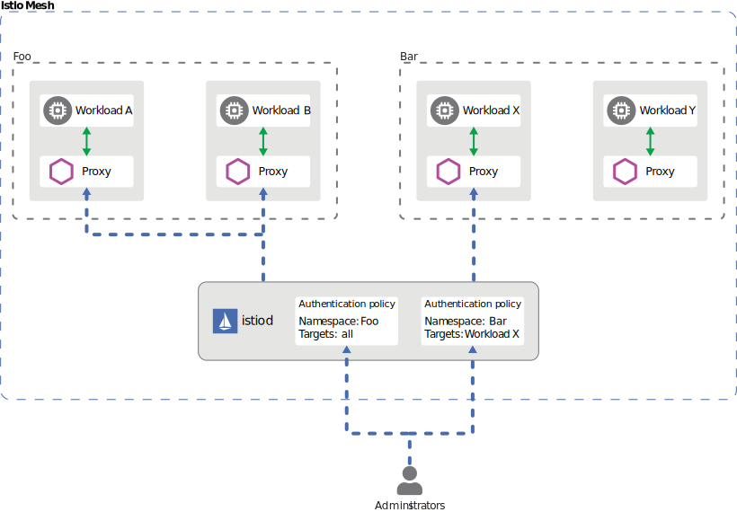

# Authentication


istio uses Kubernetes service account and istio service accounts to determine the identity of a request’s origin

## Peer authentication via mTLS



- Istio securely provisions strong identities to every workload with X.509 certificates. Istio agents, running alongside each Envoy proxy, work together with istiod to automate key and certificate rotation at scale
- Istio tunnels service-to-service communication through the client- and server-side PEPs, which are implemented as Envoy proxies.
- When a workload sends a request to another workload using mutual TLS authentication, the request is handled as follows:
    1. Istio re-routes the outbound traffic from a client to the client’s local sidecar Envoy.
    2. The client side Envoy starts a mutual TLS handshake with the server side Envoy. During the handshake, the client side Envoy also does a secure naming check to verify that the service account presented in the server certificate is authorized to run the target service.
    3. The client side Envoy and the server side Envoy establish a mutual TLS connection, and Istio forwards the traffic from the client side Envoy to the server side Envoy.
    4. The server side Envoy authorizes the request. If authorized, it forwards the traffic to the backend service through local TCP connections.

## Request authentication

[Reference](https://istio.io/latest/docs/concepts/security/#authentication-policies)

Request authentication is executed via policies

```yaml
{{#include auth-policy.yaml}}
```

### Policy scoping

Istio matches the policy to all workloads in the storage scope of the policy. Thus, the selector fields help you specify the scope of the policies:

- Mesh-wide policy: A policy specified for the root namespace without or with an empty selector field.
- Namespace-wide policy: A policy specified for a non-root namespace without or with an empty selector field.
- Workload-specific policy: a policy defined in the regular namespace, with non-empty selector field.

### Peer authentication modes

- PERMISSIVE: Workloads accept both mutual TLS and plain text traffic. This mode is most useful during migrations when workloads without sidecar cannot use mutual TLS. Once workloads are migrated with sidecar injection, you should switch the mode to STRICT.
- STRICT: Workloads only accept mutual TLS traffic.
- DISABLE: Mutual TLS is disabled. From a security perspective, you shouldn’t use this mode unless you provide your own security solution.
 