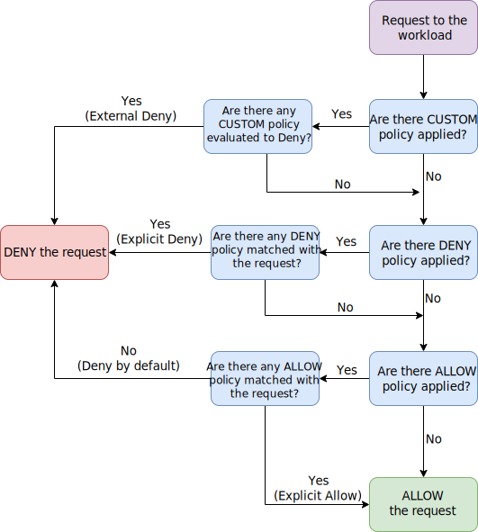

# Traffic Authorization

## Architecture

[Reference](https://istio.io/latest/docs/concepts/security/#authorization)


### Rule evaluation tree




### An example policy

```yaml
{{#include example-policy.yaml}}
```

### An example policy to allow traffic just form my namespace

```yaml
{{#include allow-self.yaml}}
```

## An example

On the product page, you can see the following sections:

- Book Details on the lower left side, which includes: book type, number of pages, publisher, etc.
- Book Reviews on the lower right of the page.

Let's create some policies to make sure the traffic flows the proper way


### Step 1: Allow nothing

```yaml
{{#include allow-nothing.yaml}}
```

```bash
kubectl apply -f allow-nothing.yaml
```

What happened?

### Step 2: Allow opening the product page

```yaml
{{#include allow-view-productpage.yaml}}
```

```bash
kubectl apply -f allow-view-productpage.yaml
```

What happened?

### Step 3: Allow all the things!

```bash
kubectl apply -f allow-details.yaml
kubectl apply -f allow-reviews.yaml
kubectl apply -f allow-ratings.yaml
```

## Caveat emperor
Istio uses mutual TLS to securely pass some information from the client to the server.
Mutual TLS must be enabled before using any of the following fields in the authorization policy:

- the principals and notPrincipals field under the source section
- the namespaces and notNamespaces field under the source section
- the source.principal custom condition
- the source.namespace custom condition
